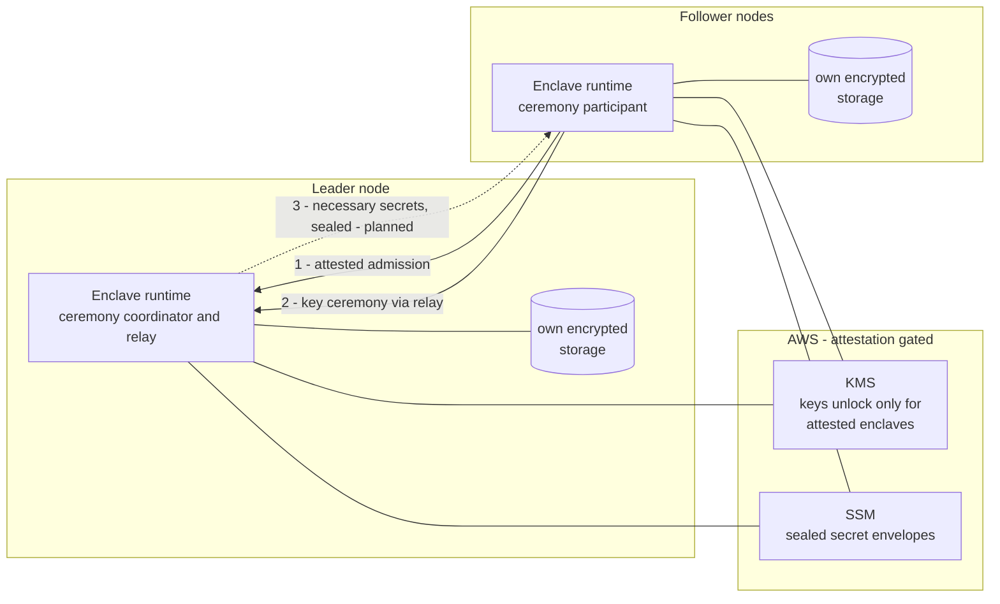
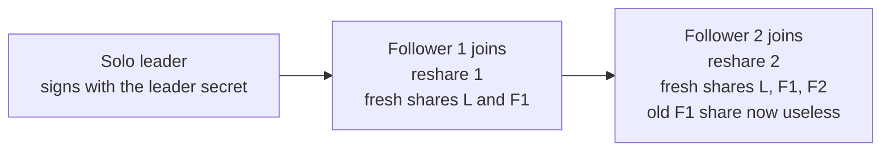
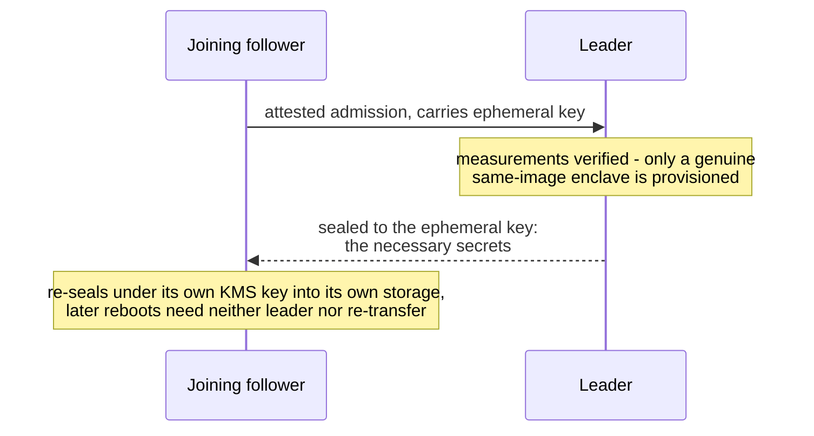

# Threshold Scaling Architecture

**Repository:** `ArkLabsHQ/enclave`, branch `dkg` · **Cryptography:** ChillDKG / FROST via
`ArkLabsHQ/threshold-magic` · **Status:** multi-node ceremony validated end-to-end in CI
(QEMU); signing integration and production hardening tracked in the roadmap (§8).

---

## 1. Executive Summary

This work introduces a **new scaling model for enclave applications, built on threshold
cryptography**. Instead of copying signing keys onto every machine, a cluster of
enclaves collectively *is* the key: each node holds only a **share**, producing a
signature requires a **quorum**, and the full key exists on no single node. The public
key that applications, verifiers, and on-chain addresses depend on **never changes** as
nodes join or leave.

**Key properties**

| Property | Meaning |
|---|---|
| Zero pre-shared trust | Nodes admit each other purely by hardware attestation — same measured image means same identity |
| Group key invariance | The group public key stays pinned to the original secret; membership changes are invisible externally |
| Proactive resharing | Every membership change re-randomizes **all** shares; captured old shares become useless |
| Opt-in per secret | Only secrets tagged `kind: signing` participate; single-node deployments are untouched |

---

## 2. How Threshold Scaling Works

The signing key never exists in one place: each node holds a **share**, and producing
a signature requires a **quorum** of nodes cooperating.

```
  +---------+     +---------+     +---------+
  | Leader  |     | Node F1 |     | Node F2 |
  | share L |     | share F1|     | share F2|
  +---------+     +---------+     +---------+
       \               |               /
        \______________|______________/
                       |
            quorum of shares => signature
       compromising one node yields < quorum
          group public key: never changes
```

Enabling it is a single field in the application's secret declaration:

```yaml
secrets:
  - name: app_key            # ordinary secret
    env_var: APP_KEY
  - name: signing_key        # threshold-scaled
    env_var: SIGNING_KEY
    kind: signing
```

---

## 3. System Overview

One node is designated **leader**; all others are **followers**. Every node boots the
**same enclave image**, so all nodes carry identical measurements (PCRs) — that shared
identity is the admission criterion. Per-node settings (role, leader address) arrive
through instance configuration, never baked into the image.




**Roles at a glance**

| | Leader | Follower |
|---|---|---|
| Holds | Leader secret (sealed) + its own share | Its own share only |
| Runs | Admission endpoint + ceremony coordinator | Ceremony participant |
| Initiates | Nothing — pure responder | Admission, join, reshare requests |
| Pins | The group key to the original secret | — |

---

## 4. Trust Model & Admission

Before a follower may participate in any key ceremony, it must prove it is a **genuine
enclave running the exact same measured image**. The follower always initiates; the
exchange is mutually attested and replay-proof:

```
Follower (initiator)                       Leader (responder)
   │                                          │
   │  1. request one-shot nonce               │
   │ ────────────────────────────────────────►│
   │ ◄────────────────────────────────────────│
   │      one-shot leader nonce (60s TTL)     │
   │                                          │
   │  2. admission request                    │
   │     attestation document:                │
   │       nonce      = leader's nonce        │
   │       user data  = {my nonce, my hostpub}│
   │       public key = my ephemeral box key  │
   │ ────────────────────────────────────────►│
   │              verify: hardware signature, PCRs == mine,
   │              nonce is one I issued (one-shot consume)
   │              authorize follower identity
   │ ◄────────────────────────────────────────│
   │     leader's attestation document:       │
   │       nonce     = follower's nonce       │
   │       user data = sealed to ephemeral key│
   │                   {leaderPub, relayPort} │
   │                                          │
   │  verify leader PCRs == mine,             │
   │  nonce echoed, unseal payload            │
   │                                          │
   │  3. join ceremony via relay → reshare    │
   │ ────────────────────────────────────────►│
```

**Security properties**

- **Mutual** — the follower verifies the leader too; a rogue "leader" cannot harvest
  join attempts.
- **Image-scoped identity** — only image, kernel, and application measurements are
  compared; host-specific values are excluded so same-image enclaves on different
  machines are admitted.
- **Replay-proof** — nonces are single-use with a short TTL.
- **Confidential** — the leader's response payload is sealed to an **ephemeral key the
  follower generated for this handshake**, inside the signed attestation. This sealed
  channel is also the planned vehicle for cluster provisioning — see roadmap item 2.
- **Defense in depth** — an admitted identity is additionally enforced at the ceremony
  protocol layer; unadmitted participants are rejected by the relay itself.

---

## 5. Key Lifecycle

### 5.1 Membership changes re-randomize everything

Every join triggers a **reshare over the same underlying secret**. Shares change;
the group public key does not.



- **Every ceremony is per secret.** Each secret tagged `kind: signing` forms its own
  independent group: ceremonies are labeled by the secret's env var, and the label
  routes every delivered share back to the right secret. Two tagged secrets mean two
  independent share sets and two group keys.
- The group public key is **identical** at every stage — pinned to the original secret,
  which only the leader holds (sealed at rest, never exported).
- Shares are delivered **live** while the node runs — the full path is §5.2.
- Persistence is a per-node **sealed envelope** (hardware-attestation-gated KMS): the
  node's current share, plus — on the leader only — the leader secret.

### 5.2 From ceremony to running application

Ceremony results arrive **asynchronously**. Both protocol engines — the leader's and
the follower's — expose their output as a **`Keys()` channel**: whenever a ceremony
completes for a `kind: signing` secret, the engine emits that node's freshly derived
**secret share** on the channel, together with the group public key and the **label**
(the secret's env var) that ties the result back to the secret it belongs to. This is
the *only* way share material ever leaves the ceremony engine.

On every node — leader included, since the leader is a full participant in its own
ceremonies — a dedicated background **listener goroutine drains `Keys()`** for the
lifetime of the process. Each delivery runs the same pipeline:

```
   ceremony completes  (per secret, labeled by its env var)
          │
          ▼
   listener goroutine receives { label, share }
          │
          ▼
   persist sealed envelope          set ENV[label] = share
   (reboot skips the ceremony)      (the share replaces the leader
          │                          secret in ENV; it stays sealed)
          ▼
   request upstream restart  (only if the app is running)
          │
          ▼
   graceful stop of the app  (SIGTERM, 10s grace, then kill)
          │
          ▼
   fresh app process forked
   → inherits the updated environment
   → signs with the re-randomized share
```

Two details make this safe:

- **The env var always holds what the node signs with *now*** — the share once a group
  exists; on a solo leader, before any follower joins, it is the leader secret itself. From
  the first reshare onward the leader secret leaves the environment, replaced by the secret share for good and the leader secret lives only
  in the sealed envelope for now.
- **The application is restarted.** A running process only reads its
  environment at startup, so after each reshare the runtime gracefully replaces the
  upstream app; the new process boots with the fresh share already in place. The
  restart is skipped when no app is running yet (e.g. a share delivered during boot),
  and the runtime itself never restarts — only the application child.

### 5.3 At rest — the sealed envelope in SSM

Each signing secret persists as **one SSM parameter per node**: a KMS-encrypted JSON
envelope. The leader secret and the share travel together in the leader's envelope,
so both are always read and written **atomically** — a share update can never drop
the leader secret.

```
    Leader envelope                        Follower envelope
    {                                      {
      leader secret: a0  ← in ENV only       share: current share
                           while solo      }
      share: own share   ← in ENV once
    }                      a group forms
```

- **On boot** the node reads its slot and decrypts inside the enclave: the share goes
  to the env var, the leader secret (leader only) to an in-memory cache — so a reboot
  never
  re-runs a ceremony.
- **On every reshare** the envelope is rewritten with the fresh share; the leader folds
  its cached leader secret back in on every write.
- **Scoping the path by KMS key id** is what makes image-upgrade key rotation atomic:
  the new key's slots are written and verified first, then a single pointer flip
  commits the rotation.

---

## 6. Cluster Data Model

A hard constraint shapes everything here:

> **Followers must never be able to reach the leader secret.** All nodes are
> measurement-identical by design, so attestation policy *cannot* tell leader from
> follower — per-instance IAM is the only boundary that can enforce leader exclusivity.

Every enclave is otherwise **self-contained**: each node runs its **own encrypted
storage** — nodes never share a datastore, and nothing here changes that. What this
work splits is the **signing key**; the only data that ever crosses between nodes is
what the protocol itself requires, passed over the sealed, attested channel. The data
therefore falls into these access classes:

| Data | Access class | Today (test topology) |
|---|---|---|
| Leader secret | **Leader only** | ✅ isolated |
| Each node's share + identity key | **That node only** | ✅ isolated |
| Storage (K/V, dynamic secrets) | **That node only** — per-enclave by design | ✅ isolated |
| Necessary secrets a joiner needs | **Passed node-to-node, sealed** | ❌ provisioning path not built yet |


---

## 7. Validation

A full **1 leader + 2 follower** cluster runs in CI on emulated Nitro hardware
(QEMU + KVM), booting three instances of the same enclave image. The suite asserts:

1. All three nodes healthy and correctly role-assigned.
2. Admission endpoint live; handshake completes.
3. Every node — leader included — ends up holding a **share**, not the leader secret.
4. The second join **re-randomizes** the first follower's share (proactive resharing
   observed, not assumed).
5. All three shares are distinct, valid scalars deriving valid public keys.

Single-node deployments run the pre-existing integration suite unchanged — threshold
scaling is fully opt-in.

---

## 8. Roadmap

**1 · Signing key package.** A share alone is not enough to sign: each node — **leader
and followers alike** — also needs a small amount of signing context. The extras are
minimal: its **participant identifier**, the **group public key**, and the current
**threshold** (derivable from membership size by the quorum policy). Per-participant
verification shares are *not* required: signing never uses them, and correctness is
guaranteed by verifying the final aggregate signature against the invariant group key
— while the attested admission already authenticates every participant, so per-share
checks would add only blame attribution, not soundness. The ceremony already computes
all of this; today it is discarded en route. Plan: surface it from the SDK, persist it
in each node's sealed envelope (rewritten on every reshare, since identifiers and
threshold change), and deliver it to the application alongside the share. A
signing-session coordination layer (nonce exchange, share aggregation) follows on top.

**2 · Provisioning necessary secrets over the attested channel.** Joining the cluster
is more than receiving a share: a new node must also be provisioned with the secrets
it needs to serve traffic — **without ever gaining access to the leader secret**
(§6). The admission handshake already establishes exactly the channel needed: the
follower presents an **ephemeral encryption key inside its attestation document**, and
the leader can seal data to it. Provisioning becomes a natural step of the join flow —
storage stays strictly per-enclave; the joiner writes what it receives into its **own**
sealed storage:



The follower re-wraps the received material under its own attestation-gated KMS key
and keeps it in its own namespace, so the transfer happens once per node, not per
boot, and no node ever reads another node's storage or parameters. Open point:
first-boot ordering — a joining node needs the leader reachable once.

**3 · Attestation binding of the group key.** Secret-derived public keys are extended
into attestation registers so remote parties can verify *which* keys an enclave holds.
Threshold shares change on every reshare, so the invariant **group** public key — not
the volatile share — should be what gets bound. Decision pending.

**4 · Membership revocation.** Resharing currently triggers on *join* only. Removing a
node needs a leave-triggered reshare and revocation of its admission, so a
decommissioned node's share is invalidated immediately rather than at the next join.

---

